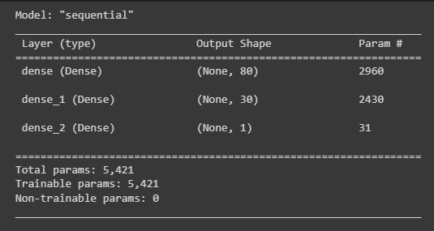
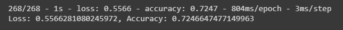
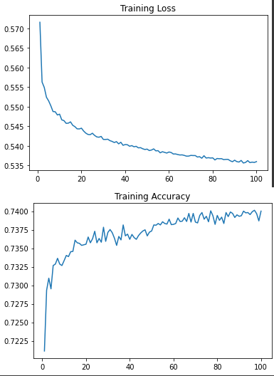
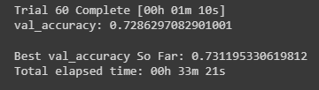
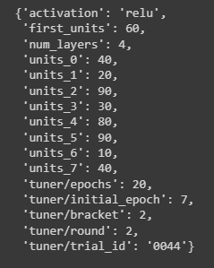
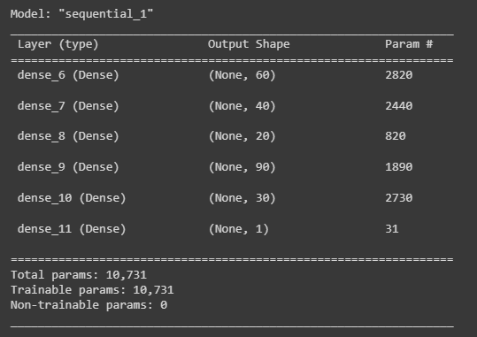
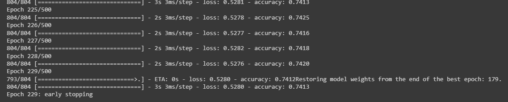
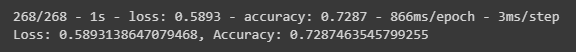
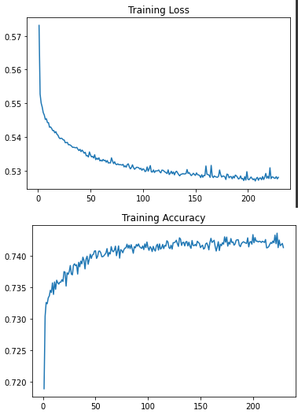

# Alphabet Soup Deep Learning Model - Testing and Analysis

- - -

## Overview of the Analysis

### Purpose

The nonprofit foundation Alphabet Soup is interested in a tool that can help them select the applicants for funding with the best chance of success in their ventures. We will be using Python to design a Deep Learning Neural Network to create a Binary Classification Model that can predict if an Alphabet Soup-funded organization will be successful based on the features in a historical funding dataset.

### The Dataset

CSV file containing more than 34,000 organizations that have received funding from Alphabet Soup over the years. Within this dataset are a number of columns that capture metadata about each organization, including:

* **`EIN`** and **`NAME`**—Identification columns  
* **`APPLICATION_TYPE`**—Alphabet Soup application type  
* **`AFFILIATION`**—Affiliated sector of industry  
* **`CLASSIFICATION`**—Government organization classification  
* **`USE_CASE`**—Use case for funding  
* **`ORGANIZATION`**—Organization type  
* **`STATUS`**—Active status  
* **`INCOME_AMT`**—Income classification  
* **`SPECIAL_CONSIDERATIONS`**—Special considerations for application  
* **`ASK_AMT`**—Funding amount requested  
* **`IS_SUCCESSFUL`**—Was the money used effectively

### Process

From this labeled dataset, we built a [neural network model](Colab_Notebooks/Alphabet_Soup_Model.ipynb) to predict if historical funding was marked "IS_SUCCESSFUL" or not using `Binary Classification Analysis`, and then set about several attempts at building a [second model](Colab_Notebooks/AlphabetSoupCharity_Optimization.ipynb) to optimize those results with the goal of a 75% accuracy rate, according to the process outlined below:

#### Data Preprocessing

1. Binning rare occurances of categorical values with more than 10 unique values into an "Other" category for clarity.

2. Encoding all categorical values into 1s and 0s so our model can parse them.

3. Splitting the data into a "features" array `X` and a "target" array `y` and further splitting those into `training` and `testing` datasets.
    * We determined that the `IS_SUCCESSFUL` column was our target value, and so set this as our `y` array.
    * We determined that the `EIN` and `NAME` columns were neither targets nor features, and so removed them from the dataset.
    * We determined that the remaining columns were our features, and so set them as our `X` array.

4. Scaling the `training` and `testing` features to a standard level so no values are overly favored by the algorithm.

#### Model Creation

1. Assigning the number of layers, neurons, and activation functions to the first model.

2. Compiling and training the model.

3. Evaluating the model using the testing data to calculate its loss and accuracy.

4. Plotting the training history loss and accuracy scores for context and comparison.

5. Saving and exporting the model to an `HDF5` file.

#### Model Optimization

1. Initial attempts were made to simplify the input data & remove potential outliers, but this caused the network to perform more poorly.

2. Adjusting the input data to improve accuracy and correct for possible underfitting, we modified the binning process to allow for more complexity in the dataset.

3. Importing `keras tuner` and attempting many variations in model depth, number of neurons per layer, alternative activation functions on a test run of 20 epochs.

4. Feeding the results of this test run into a new model, with a varying number of epochs in the training regimen based on whether the training loss continued to improve, using an early-stopping callback function.

## Results

### Neural Network 1

* **Description of Model:** We created our initial model with an input layer of 80 nodes and a hidden layer of 30 nodes assigned, loosely shooting for a simpler model with about a double nodes to features ratio after preprocessing as a starting point. We used a `Rectified Linear Unit` activation as none of our values were negative and this is generally a more efficient activation function to start with.  All models' output layer had one unit and used a `Sigmoid` function to condense results into a binary classifaction.  This model was run for a 100 epoch training regimen.  

**Model 1 Summary:**  

* **Model Performance:**  
  * **Accuracy:** 72.47%
  * **Loss:** 0.56

**Model 1 Results:**  

**Model 1 Training History:**  

### Neural Network 2

* **Description of Model:** After several attempts, the best results achieved came from a model with the following characteristics:  
  * 4 hidden layers
  * `Rectified Linear Unit` activation function
  * 60 neurons on the first input layer
  * Hidden layer neurons as follows:
    * 40 units
    * 20 units
    * 90 units
    * 30 units
  * A training regimen of 179 epochs which achieved the best weights with our early stoppping callback activated

**Keras Tuner Best Run:**  
  

**Model 2 Summary:**  
  

* **Model Performance:**
    * **Accuracy:** 72.87%
    * **Loss:** 0.59

**Model 2 Results:**  

**Model 2 Training History:**  

#### Optimization Notes

Because of the randomization, the notebook example differs from the examples shown in these images, which reflect the highest score we were able to achieve in our attempts.  Each run will be slightly different from the last.  In our highest accuracy score, we also have a higher loss score, so it is possible this is a slight overfit.

## Summary

In our attempts, we were not able to achieve the target of 75% accuracy in predicting if those who received funding were successful or not successful based on the features in our dataset.  

Several attempts were made using `Keras Tuner`, which runs randomized trial models with different parameters specified by our experiements.  We found that in these trials, deeper networks (those with more layers) tended to perform better, but after about 100 neurons per layer there was a point of diminishing returns.  We also saw a marked improvement in the training data when increasing the size of the first layer, but the results for the test data decreased in direct proportion, implying that this strategy only lead to overfitting.

In all our runs, we rarely saw the training accuracy break above 74%, which is when the network can see the answers, and never above 75%, so we are confident that a real world result of 75% on test data would not be possible using this method.

### Recommendations

It could be possible that a different kind of linear supervised machine learning model may be able to solve this classification problem more effectively, possibly a Decision Tree or Random Forest model due to the prevalence of categorical variables involved.  We would recommend further testing to determine if this is a good strategy.

While this model did not meet the requested specifications, it does still provide useful information, as the original dataset gives us a 53.24% chance of determining which funded organizations will be successful, and this model puts us in the range of 72.46% - 72.87%.  It could be a useful tool for prediction, but we wouldn't recommend it being the *only* tool used to make funding decisions in the future due to the reasons outlined above.

- - -

## References

IRS. Tax Exempt Organization Search Bulk Data Downloads. [https://www.irs.gov/](https://www.irs.gov/charities-non-profits/tax-exempt-organization-search-bulk-data-downloads)